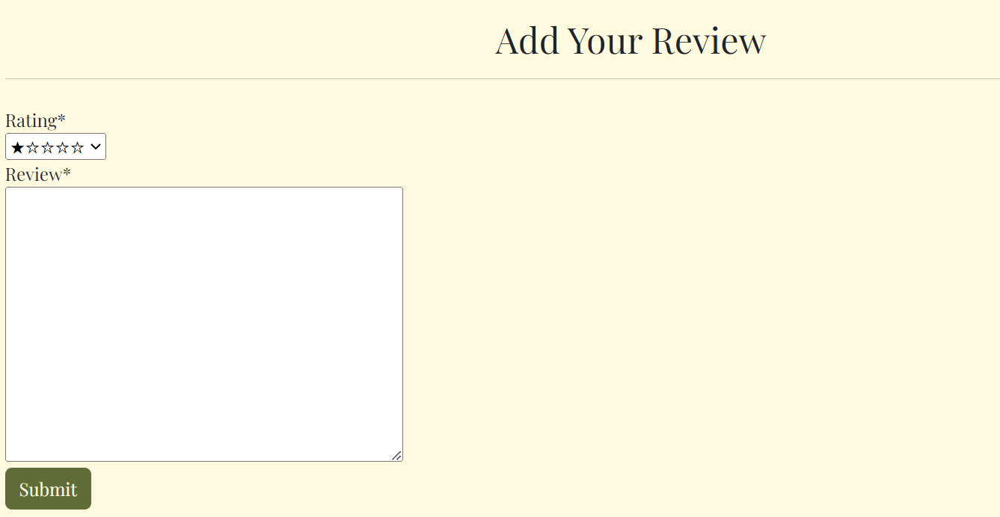
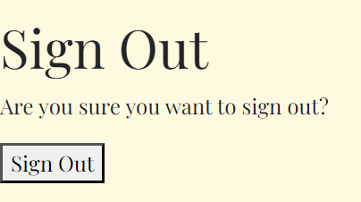

# Project Portfolio Five: Clean Cosmetics

[Link to live site]()

Clean Cosmetics is an ecommerce application specifically design to facilitate commercial transactions, and involves an online transfer of information.

# Table Of Contents

-   [User Experience](#user-experience)
    -   [User Stories](#user-stories)
    -   [Site Goals](#site-goals)
    -   [Scope](#scope)
-   [Design](#design)
    -   [Colour Scheme](#colour-scheme)
    -   [Database Schema](#Database-Schema)
    -   [Fonts](#Fonts)
    -   [Wireframes](#Wireframes)
    -   [Agile Methodology](#Agile-Methodology)
         -   [Overview](#overview)
         -   [EPICS(Milestones)](#epicsmilestones)
         -   [User Stories issues](#user-stories-issues)
         -   [MoSCoW prioritization](#moscow-prioritization)
         -   [GitHub Project](#github-project)
-   [Features](#features)
-   [Future Features](#future-features)
-   [Marketing](#marketing)
-   [Search Engine Optimization SEO](#search-engine-optimization-seo)
-   [Testing](#testing)
-   [Bugs](#Bugs)
-   [Technologies And Languages](#technologies-and-languages)
    -   [Languages Used](#languages-used)
    -   [Python Modules](#python-modules)
    -   [Technologies and programs](#technologies-and-programs)
-   [Deployment](#deployment)
    -   [Before Deployment](#before-deployment)
    -   [Deployment on Heroku](#deployment-on-heroku)
    -   [Creating A Fork](#creating-a-fork)
    -   [Cloning Repository](#cloning-repository)
-   [Credits](#credits)
    -   [Media](#media)
    -   [Code](#code)

## User Experience

### User Stories

1. As a authenticated user I can easily sign in and sign out so that I can effortlessly access my personal account and perform specific operations eg. make a purchase, review product etc.

2. As a new site user I can easily register for an account so that I can have my own personal account which as a result allows me to access additional features eg. add products to shopping bag.

3. As a registered user I can easily recover my password so that I can access my account again.

4. As a site user I can view the products list so that I can easily discern the product information and select a product to purchase.

5. As a site user I can view an individual products information so that I can identify the price, description, product rating, category etc. of the product.

6. As a site admin I can add a product so that add new products to my store.

7. As a site admin I can remove a product so that add remove products from my store.

8. As a site admin I can edit a product so that add update products accordingly in my store.

9. As a newly registered user I can receive a confirmation email after registering so that ensure my account registration was successful.

10. As a register user I can view my personalized user profile so that I can see my order history and add/edit my payment details.

11. As a site user I can search for a product by name or description so that easily find what I want to buy/view.

12. As a registered user I can view items that have been added to my bag so that see the total cost and view the list of products.

13. As a registered I can review products so that I can express my opinion on products.

14. As a registered user I can easily select the quantity of a product when purchasing so that I am sure I won't select the incorrect amount.

15. As a registered user I can easily enter my personal information and payment details so that I can checkout fast without issues.

16. As a registered user I can receive an email confirmation after checking out so that I can ensure proof of purchase.

17. As a site user I can easily navigate the website so that I can find what I'm looking for comfortably.

18. As a site user I can contact the store so that raise concerns or simply ask for help.

19. As a site user I can read the privacy policy so that I know how my data is processed.

20. As a site user I can filter the products by category so that quickly find what I'm looking for/intending to buy.

21. As a site user I can contact the store so that raise concerns or simply ask for help,

22. As a site user I can browse the trending topics page so that read interesting topics about what is happening in the beauty industry.

23. As a registered I can review products so that I can express my opinion on products.

### Site Goals

1. To provide users with a place to purchase beauty products of their interest.
2. To provide users the ability to search and browse all cosmetic products.
3. To provide 

### Scope

The goal of this project is to develop an e-commerce website offering natural cosmetic products to customers. The website will be responsive and user-friendly, providing the customer with the ability to:

1. Register and Login
2. Reset Password
3. Browse, search and filter products by category
4. Add products to shopping cart
5. Purchase items securely by using the integrated Stripe payment system

#### Key Features

1. Products:
- Users can view all products and refine them by category
- Users can view information about each product including image and description
- Users can search products by title and description

2. User Authentication:
- Users can register an account, allowing them access to all of the website's functionality
- Registered users can login and logout
- Users can reset their password

3. Orders and checkout:
- Users can add items to their shopping bag
- Users can securely checkout to pay for their items

4. Admin functionality:
The following functionality is limited to superusers/admins.
- Admins can access the admin dashboard, containing of a list of products and summary of orders
- Admins can add products for sale
- Admins can delete products from the system
- Admins can edit products

6. Notification Messages:
- Users will receive notification messages when performing CRUD operations, login, logout, and register actions.

## Design

### Colour Scheme

The sites colour scheme has a collection of earthy natural tones that coincide with the purpose of the website - beauty products that are made entirely with natural ingredients. The colours reinforce the website's motivation to stick to the au naturale theme.

### Fonts

The main font used across the site is the Playfair Display font. The Lato font is used for large chunks of text such as the product description. The Playfair Display font has a showy style, whereas the Lato font is better for large text areas as it's more legible.

### Database Schema

1. User:
The User model is a part of the Django Allauth library. The model comes with predefined fields as standard,for example, username, email, name, password, etc. This model is used for user authentication, hence why changes directly to this model are not advisory. The User model is connected to the UserProfile model with one to one relationship.

2. UserProfile:
The UserProfile model is a custom custom-created model to handle the user profile details. Signals are used to reflect the changes between the User and UserProfile models.

3. Category
This model was created for the purpose of defining categories for the products

4. Product
This model was created to add products

5. Brand
This model stores the brand of each category of product

6. Topic
This is a custom product model. It is designed to form the fields of a blog post.

7. UserReview 
This model stores the user's reviews for a product. It is connected to the UserProfile and the Book models as a ForeignKey

8. Order 
This model holds all the information of the user's order. It is connected to the UserProfile as a ForeignKey.

9. OrderStatus
This model is connected to the Order model with OneToOneField. When an Order is created a signal creates OrderStatus. The default value is 'in progress' with additional options of Completed and Cancelled. 

10. OrderLineItem
This model is connected to the Order and Book as a ForeignKey. It is created for each item in the order

### Wireframes

### Agile Methodology

#### Overview

This is how I planned out my user stories with the agile methodology in mind I created a gantt chart so that I could have a visual representation of my project plan.

#### User Stories Issues

The structure of the user story issue consists of the user story, acceptance criteria, and tasks that outline the steps that are required for this issue to be completed.

#### MoSCoW prioritization

This prioritization technique was used to prioritize the features and requirements of the project based on their importance. The acronym "MoSCoW" stands for "Must have, Should have, Could have, and Won't have." Each category helps to prioritize features to guide the development process and ensure that the most essential elements are targeted first.

#### Github Project

The project was created using a basic Kanban Board structure, divided into columns Todo, In Progress and Done.. This setup provides a clear and organized way to track the status of tasks and visualize and manage the workflow.

## Features

#### Navbar
The navbar was built using bootstrap 5. The search bar allows the users to search for products. The My Account drop down gives the user the option to log in or register. If the user is authenticated additional menu options are displayed like my profile and admin (if the user is a superuser). The shopping cart icon is a link to the shopping cart and it also displays the total of the items in the cart.
The nav links allow the user to refine the products by category or to accesss the contact us page and the trending topcis blog.

### Toasts
Toasts from Bootstrap were implemented to provide customers with feedback in relation to their actions on the website.

#### Footer
The footer consist of links to social media.

### Home Page
#### Hero Section
The hero section is the beginning of the whole customer's journey. That is why I made it a priority to create appealing hero section. 
The text on the left communicates the entire purpose of the site.
The hero section image was carefully selected to display the nature element of the website and matches the colour scheme.
This is then followed by call-to-action button Shop Now which invites the user to browse through the available products.

### Products Page
The products page renders all products to the user.

### Single Products Page
On the page's left side, a product image is displayed. On the right side, the description about the product is displayed. This includes the title, brand, price and reviews.
If a user is authenticated they can access the add review page, edit review page. If it is an admin they can edit or delete the product itself.

### Review Page
This page displays the product details and their corresponding reviews.

### Add Review
When an authenticated user logs in to the site and they click on a product card, they can see the review button which redirects them to the add review page. Here they can review and rate the selected product.

### Contact Us Page
The contact us displays a form for users to contact the admin.

### Contact Us Confirmation Page
Once a form has been submitted, the contact us confirmation page is displayed.

### Trending Topics
This page renders a list of blog posts about the beauty industry, specifically relating to organic beauty, nature and overall health.

### Topics Detail
The topics detail page opens up the post and the user can read it in full.

### Sign In Page
The sign in page allows registered users and admins to sign in with their details.

### Sign Out Page
The sign out page allows logged in users to sign out successfully, with a toast confirmation appearing afterwards.

### Sign Up Page
The sign up page allows new clients to register.

### Forgot Password
This page allows registered users to reset their passwords via email.

### Password Reset Confirmation
The page confirms to users that an email has been sent to reset their password.

### My Profile
The My Profile page is for registered users to access their order history and update their information if they wish.

### Admin Page
The admin page allows admins only to add products to the site.

### Admin Edit/Delete Products
When an admin is logged in to the site and they click on a product card, they can see the edit and delete options to edit or delete a product if they wish.

## Testing

## Technologies And Languages

### Languages Used

- HTML
- CSS
- JavaScript
- jQuery
- Bootstrap
- Python
- Django

### Python Modules

- dj-database-url - This library is used to parse the database URL specified in the DATABASE_URL environment variable, which is commonly used for configuring database connections in Django
projects.

- gunicorn - Gunicorn is a popular WSGI (Web Server Gateway Interface) HTTP server for running Python web applications, including Django applications, in a production environment.

- Pillow - Pillow is a Python Imaging Library (PIL) fork that provides tools for working with images in various formats.

- psycopg2 - Psycopg2 is a PostgreSQL adapter for Python. It allows Django to connect to PostgreSQL databases.

- Black - Black is a Python code formatter that coincides with the PEP8 guidelines.

### Technologies and programs

- [GitHub](https://github.com/) is the hosting site used to store the code for the website.
- [Google Fonts](https://fonts.google.com/) was used to import fonts.
- [Stripe](https://stripe.com/en-ie) was integrated to handle payment processing in a secure and convenient way.
- [W3C HTML Validator](https://validator.w3.org/) was used to check for errors in the HTML code.
- [W3C CSS Validator](https://jigsaw.w3.org/css-validator/) was used to check for errors in the CSS code
- [Js Hint](https://jshint.com/) was used to validate the JavaScript code.
- [CI Python Linter](https://pep8ci.herokuapp.com/) was used to validate the Python code.
- [Coolors.co](https://coolors.co/) was used to display the colour scheme.

## Deployment

### Before Deployment

### Stripe setup

- Log in to [Stripe](https://stripe.com/en-ie)
- Navigate to developers section (link located at the top right)
- Go to API keys tab and copy the values of PUBLIC_KEY and SECRET_KEY and add them to your env.py file
- Navigate to the Webhooks page from the tab in the menu at the top and click on add endpoint.
- This section requires a link to the deployed application. The link should look like this https://your_website.herokuapp.com/checkout/wh/ 
- Choose the events the webhook should recieve and add endpoint.
- When the application is deployed, run a test transaction to ensure the webhooks are working. The events chan be checked in the webhooks page.

### Deployment on Heroku

### Creating a fork

1. Navigate to the [repository](https://github.com/erincunningham7/project-portfolio-five)
2. In the top-right corner of the page, click the 'Fork' button and select create a fork
3. You have the option change the name of the fork and/or add a description 
4. Copy the main branch only, or all branches to the new fork
5. Click 'Create a Fork'
6. A repository will then appear in your GitHub

### Cloning Repository

1. Navigate to the [repository](https://github.com/erincunningham7/project-portfolio-five)
2. In the top of the repository, click on the 'Code' button and copy the link 
3. Open Git Bash and change the working directory to the location where you want the cloned directory to be
4. Type 'git clone' and then paste the link
5. Press 'Enter' to create your local clone

## Credits

### Media

### Code

- The Boutique Ado Walkthrough was used for the base of this website
- [Django Allauth Documentation](https://docs.allauth.org/en/latest/installation/quickstart.html) was used to install the allauth library and styling
-[Crispy Forms docs](https://django-crispy-forms.readthedocs.io/en/latest/install.html) was used to install the crispy forms package

